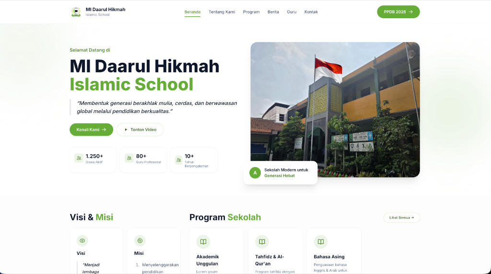

# 🏫 Website Sekolahan

**Website Sekolahan** adalah aplikasi website sekolah modern berbasis **Laravel 13**, **Livewire 4**, dan **TailwindCSS 4**. Didesain untuk memudahkan sekolah dalam mengelola informasi, berita, program unggulan, pendaftaran siswa baru (PPDB), hingga data guru — semuanya dalam satu platform yang elegan dan responsif.



---

## ✨ Fitur Utama

| Fitur | Deskripsi |
|---|---|
| 🏠 **Landing Page** | Halaman publik yang modern dan responsif |
| 📰 **Manajemen Berita** | CRUD berita dengan rich text editor (Tiptap) |
| 📚 **Program Sekolah** | Kelola program unggulan sekolah |
| 👨‍🏫 **Data Guru** | Profil guru lengkap dengan sosial media |
| 📝 **PPDB Online** | Formulir pendaftaran siswa baru |
| 📩 **Pesan Kontak** | Terima pesan dari pengunjung website |
| 🗓️ **Jadwal Kunjungan** | Pengelolaan jadwal kunjungan sekolah |
| 👤 **Multi-Role Auth** | Sistem login dengan peran Admin & Guru |
| ⚙️ **Pengaturan Dinamis** | Ubah nama sekolah, warna brand, kontak, dll. dari panel admin |
| 🎨 **Brand Color** | Tema warna yang bisa dikustomisasi dari panel admin |

---

## 🛠️ Tech Stack

- **Backend:** PHP 8.3+, Laravel 13
- **Frontend:** Livewire 4, TailwindCSS 4, Vite 8
- **Rich Editor:** Tiptap
- **Database:** SQLite (default) / MySQL
- **Testing:** PestPHP

---

## 📋 Persyaratan Sistem

Pastikan komputer kamu sudah terinstal:

- **PHP** >= 8.3
- **Composer** >= 2.x
- **Node.js** >= 20.x
- **NPM** >= 10.x
- **Git**

---

## 🚀 Cara Menggunakan Source Code

### 1. Clone Repository

```bash
git clone https://github.com/eldorray/website-sekolahan.git
cd website-sekolahan
```

### 2. Install Dependencies

```bash
# Install PHP dependencies
composer install

# Install Node.js dependencies
npm install
```

### 3. Konfigurasi Environment

```bash
# Salin file .env
cp .env.example .env

# Generate application key
php artisan key:generate
```

### 4. Setup Database

Secara default, aplikasi menggunakan **SQLite**. Cukup buat file database-nya:

```bash
touch database/database.sqlite
```

> 💡 Jika ingin menggunakan **MySQL**, ubah konfigurasi `DB_CONNECTION` di file `.env`:
>
> ```env
> DB_CONNECTION=mysql
> DB_HOST=127.0.0.1
> DB_PORT=3306
> DB_DATABASE=website_sekolahan
> DB_USERNAME=root
> DB_PASSWORD=
> ```

### 5. Migrasi & Seed Database

```bash
# Jalankan migrasi untuk membuat tabel
php artisan migrate

# Isi data contoh (admin, guru, berita, program, dll.)
php artisan db:seed
```

### 6. Link Storage

```bash
php artisan storage:link
```

### 7. Jalankan Aplikasi

```bash
# Jalankan semua service sekaligus (server, queue, logs, vite)
composer dev
```

Atau jalankan secara terpisah:

```bash
# Terminal 1 — Server
php artisan serve

# Terminal 2 — Vite (frontend build)
npm run dev
```

Buka browser dan akses: **http://localhost:8000**

---

## 🔐 Akun Default

Setelah menjalankan `php artisan db:seed`, kamu bisa login dengan akun berikut:

| Role | Email | Password |
|---|---|---|
| **Admin** | `admin@school.id` | `password` |
| **Guru** | `fathoni@school.id` | `password` |

- **Panel Admin:** http://localhost:8000/admin
- **Panel Guru:** http://localhost:8000/guru

---

## 📁 Struktur Direktori

```
website-sekolahan/
├── app/
│   ├── Http/Middleware/      # EnsureRole middleware
│   ├── Livewire/
│   │   ├── Admin/            # Komponen panel admin
│   │   ├── Auth/             # Login
│   │   ├── Guru/             # Komponen panel guru
│   │   └── Public/           # Komponen halaman publik
│   ├── Models/               # Eloquent models
│   └── Support/              # Helper (ColorPalette, dll.)
├── database/
│   ├── migrations/           # Skema database
│   └── seeders/              # Data contoh
├── resources/
│   ├── css/                  # Stylesheet
│   ├── js/                   # JavaScript
│   └── views/
│       ├── components/       # Blade components
│       ├── layouts/          # Layout templates
│       ├── livewire/         # Livewire views
│       └── pages/            # Halaman publik
├── routes/
│   └── web.php               # Definisi route
└── screenshots/              # Screenshot aplikasi
```

---

## 🌐 Halaman Publik

| Halaman | URL |
|---|---|
| Beranda | `/` |
| Tentang Kami | `/tentang-kami` |
| Program | `/program` |
| Berita | `/berita` |
| Tim Guru | `/tim-guru` |
| Kontak | `/kontak` |
| PPDB | `/ppdb` |

---

## 🏗️ Build untuk Produksi

```bash
npm run build
```

---

## 📄 Lisensi

Project ini menggunakan lisensi [MIT](https://opensource.org/licenses/MIT).

---

<p align="center">
  Dibuat dengan ❤️ menggunakan Laravel, Livewire & TailwindCSS
</p>
